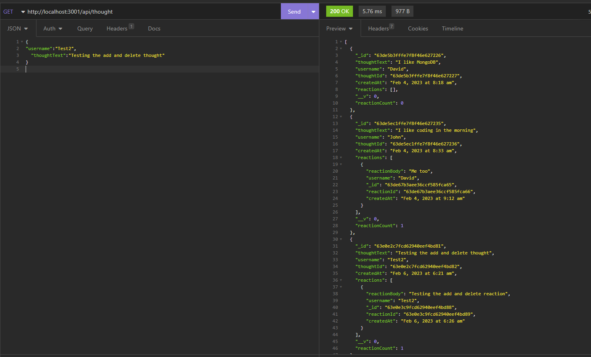

# Social-Network-API
-	A social network web application where users can share their thoughts, react to friends’ thoughts, and create a friend list using a NoSQL database. App uses Express.js for routing, a MongoDB database, and Mongoose for model creation, validation, query building, and data manipulation of the data stored in MongoDB.
# Features for the App 
-----------------------------------------------------------------------  
-	When the user enters the commands to invoke the application, the server is started, and the Mongoose models are synced to the MongoDB database.
-	Users can open API GET routes for users and thoughts listed in the database. Each of the routes displays information in a JSON format.
- Users can post, put, and delete routes to create, update, and delete users and thoughts in the database, respectively. 
- Users can also create and delete reactions to thoughts and add and remove friends to a user’s friend list.
# Built with
-----------------------------------------------------------------------
-	NoSQL Database, MongoDB
-	Express
-	Mongoose 
## Installation
-----------------------------------------------------------------------

Installations needed to use the App 
```bash
-	npm install 
-	npm install express
-	npm install mongoose
```
# Links
-----------------------------------------------------------------------
### [Demo Video](https://youtu.be/rMnoTxdJhcQ)
### [Repository](https://github.com/Micky-Ad/Social-Network-API)


# Screenshot:
----------------------------------------------------------------------

  
 

# Usage:
----------------------------------------------------------------------
-	A social network web application where users can share their thoughts, react to friends’ thoughts, and create a friend.

# License:
-----------------------------------------------------------------------
[MIT](https://choosealicense.com/licenses/mit/)


